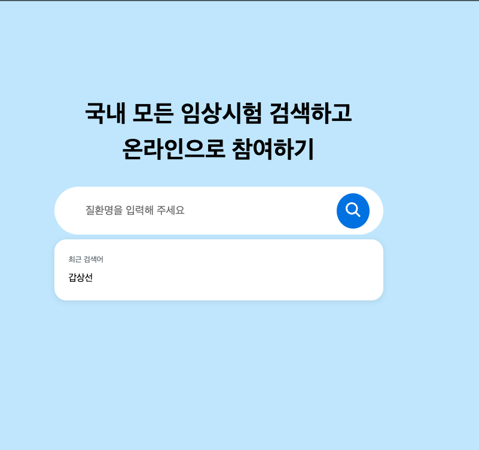

# 유재형

## 과제

[과제 관령 링크](https://clinicaltrialskorea.com/)

해당 링크에 기능처럼 검색했을 때 추천 검색어가 뜨게하고 같은 검색어가 입력 됐을 때는 캐싱 기능을 사용해서 api 호출을 하지 않고 연관 검색어가 나타나게 구현 것이 목접입니다.

---

## 기본 UI




---

## 기능 설명 🔧

`useDebounce`   
검색어를 입력했을 때 완벽히 입력될 때 api 호출을 보낼 수 있도록 딜레이를 주는 역할을 합니다.

```js
import { useState, useEffect } from 'react';

function useDebounce(value, delay) {
  const [delayValue, setDelayValue] = useState(value);

  useEffect(() => {
    const timer = setTimeout(() => {
      setDelayValue(value);
    }, delay);

    return () => {
      clearTimeout(timer);
    };
  }, [value, delay]);

  return delayValue;
}

export default useDebounce;

```

##  후기 📍
 
이번 과제에서는 기능 구현을 끝마치지 못했지만 다른 팀원분들이 구현한 것을 보고 어렵게 생각하지 않고 다양한 방법으로 접근할 수 있는 걸 알게 되었습니다.